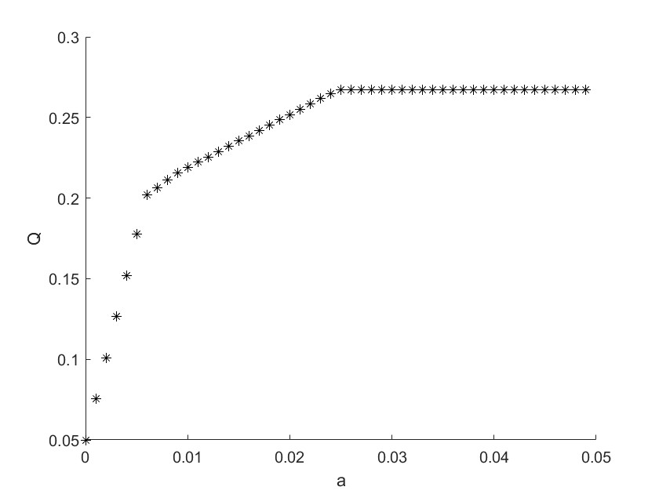

[toc]
# 数模学习报告
---

## 论文架构
- 题目
- 摘要，关键词
- 问题重述
- 问题假设
- 问题分析
- 符合说明
- 模型建立
- 模型求解
- 模型优缺点评价
- 参考文献

---

## 赛题类型

### 预测类
解决预测类赛题的一般步骤:
1.确定预测目标;
2.收集、分析资料;
3.选择合适的预测方法进行预测;
4.分析评价预测方法及其结果;
5.修正预测结果;
6.给出预测结果。

### 评价类
解决评价类赛题的一般步骤:
1.明确评价目的;
2.确定被评价对象;
3.建立评价指标体系；
4.确定各指标相对应的权重系数;
5.选择或构造综合评价模型;
6.计算各系统的综合评价值
7.给出综合评价结果。

### 机理分析类
在求解机理分析类问题时首先需要探寻与问题相关的物理，化学，经济等相关的知识，然后通过对已知数据或现象的分析对事物的内在规律做出必要的假设，最后通过构建合适的方程或关系式对其内在规律进行数值表达

### 优化类
解决预测类赛题的一般步骤:
1.确定优化目标;
2.确定决策变量;
3.构建目标函数;
4.根据已知条件构建约束条件;
5.选择合适的方法求解目标函数;
6.给出优化结果。

---

## MATLAB基础学习
### 基本指令
清屏：`clc`
清除数据：`clear`


### 基本运算
显示某变量：`disp()`
e指数：`exp()`
以e为底对数：`log()`
以n为底对数（n=2为例）：`log2()`
取b除以a的余数：`mod(b,a)`
向下取整：`floor()`
向上取整：`ceil()`

**矩阵生成**
行矩阵：逗号或空格隔开元素
```matlab
ju1 = [1,2,3];
ju2 = [1 2 3];
```
列矩阵：分号隔开元素
```matlab
ju3 = [1;2;3];
```


## 数学模型

### 线性规划模型
用于解决优化类问题

**线性规划的Matlab标准形式** :cat:💕
$$
\begin{align*}
\min_{x} \quad & c^{T}x \\
\text{s.t.} \quad & \begin{cases}
Ax \leq b \\
Aeq \cdot x = beq \\
lb \leq x \leq ub
\end{cases} 
\end{align*}
$$

其中 *c, x* 为n维列向量，*A, Aeq* 为m维矩阵，*lb, ub* 为n维列向量。

**Matlab 求解命令**
$$
\begin{align*}
&[x,fval] = \text{linprog}(c,A,b)\\
& or \quad[x,fval] = \text{linprog}(c,A,b,Aeq,beq)\\
& or \quad[x,fval] = \text{linprog}(c,A,b,Aeq,beq,lb,ub)
\end{align*} 
$$
其中 x 返回的是决策向量的取值， 返回的是目标函数的最优值。fval

>举个例子：
$$
\begin{align*}
\max\quad & z = 2x_1 + 3x_2 - 5x_3\\
\text{s.t.}\quad & x_1 + x_2 + x_3 = 7\\
& 2x_1 - 5x_2 + x_3 \geq 10\\
& x_1 + 3x_2 + x_3 \leq 12\\
& x_1, x_2, x_3 \geq 0
\end{align*}
$$
将下列表达式写成Matlab求解命令：
``` matlab
f=[-2;-3;5]; 
a=[-2,5,-1;1,3,1]; b=[-10;12];
aeq=[1,1,1];
beq=7;
[x,y]=linprog(f,a,b,aeq,beq,zeros(3,1));
x,y=-y
```

>- 由于 linprog 函数是用于求解最小化问题，所以在代码里目标函数的系数向量 f 取了负号，最后又将结果 y 取负以得到原最大化问题的最优值。
>- 对于不等式$ 2x_1 - 5x_2 + x_3 \geq 10 $其不等号符号与标准形式相反，系数符号全取反以完成不等号方向转变。
>- $[x,y]=linprog(f,a,b,aeq,beq,zeros(3,1))$; 里，$zeros(3, 1)$ （表示生成一个 3 行 1 列的零矩阵）作为 linprog 函数的输入参数，用于设定变量的下界约束。它表示有 3 个决策变量，并且每个决策变量的下限值都为 0，即要求决策变量 $x_1 \geq 0$、$x_2 \geq 0$ 和$x_3 \geq 0$ 。


**可以转化为线性规划的问题的处理方法**
规划问题如下：

\[
\begin{align*}
\min\quad & |x_1| + |x_2| + \cdots + |x_n| \\
\text{s.t.}\quad & Ax \leq b
\end{align*}
\]
其中 \(x = [x_1 \cdots x_n]^T\)，\(A\) 和 \(b\) 为相应维数的矩阵和向量。

要把上面的问题变换成线性规划问题，只要注意到事实：对任意的 \(x_i\)，存在 \(u_i, v_i \geq 0\) 满足
\[
x_i = u_i - v_i, \quad |x_i| = u_i + v_i
\]
事实上，我们只要取 \(u_i = \frac{x_i + |x_i|}{2}\)，\(v_i = \frac{|x_i| - x_i}{2}\) 就可以满足上面的条件。

这样，记 \(u = [u_1 \cdots u_n]^T\)，\(v = [v_1 \cdots v_n]^T\)，从而我们可以把上面的问题变成
\[
\begin{align*}
\min\quad & \sum_{i = 1}^{n}(u_i + v_i) \\
\text{s.t.}\quad & \begin{cases}
A(u - v) \leq b \\
u, v \geq 0
\end{cases}
\end{align*}
\]

**多目标规划问题转化为线性规划问题**
例题：
市场上有 \(n\) 种资产 \(s_{i}\ (i = 1,2,\cdots,n)\) 可以选择，现用数额为 \(M\) 的相当大的资金作一个时期的投资。这 \(n\) 种资产在这一时期内购买 \(s_{i}\) 的平均收益率为 \(r_{i}\)，风险损失率为 \(q_{i}\)，投资越分散，总的风险越少，总体风险可用投资的 \(s_{i}\) 中最大的一个风险来度量。

购买 \(s_{i}\) 时要付交易费，费率为 \(p_{i}\)，当购买额不超过给定值 \(u_{i}\) 时，交易费按购买 \(u_{i}\) 计算。另外，假定同期银行存款利率是 \(r_{0}\)，既无交易费又无风险（\(r_{0}=5\%\)）。

已知 \(n = 4\) 时相关数据如表 \(1.1\)。 
表1.1 投资的相关数据
| \(s_{i}\) | \(r_{i}(\%)\) | \(q_{i}(\%)\) | \(p_{i}(\%)\) | \(u_{i}(元)\) |
| --------- | ------------- | ------------- | ------------- | ------------- |
| \(s_{1}\) | 28            | 2.5           | 1             | 103           |
| \(s_{2}\) | 21            | 1.5           | 2             | 198           |
| \(s_{3}\) | 23            | 5.5           | 4.5           | 52            |
| \(s_{4}\) | 25            | 2.6           | 6.5           | 40            |

试给该公司设计一种投资组合方案，即用给定资金\(M\)，有选择地购买若干种资产或存银行生息，使净收益尽可能大，使总体风险尽可能小。

**一、符号规定**
- \(s_{i}\)表示第\(i\)种投资项目，如股票，债券等，\(i = 0,1,\cdots,n\)，其中\(s_{0}\)指存入银行；
- \(r_{i},p_{i},q_{i}\)分别表示\(s_{i}\)的平均收益率，交易费率，风险损失率，\(i = 0,\cdots,n\)，其中\(p_{0}=0\)，\(q_{0}=0\)；
- \(u_{i}\)表示\(s_{i}\)的交易定额，\(i = 1,\cdots,n\)；
- \(x_{i}\)表示投资项目\(s_{i}\)的资金，\(i = 0,1,\cdots,n\)；
- \(a\)表示投资风险度；
- \(Q\)表示总体收益。 

**二、基本假设**
(1) 投资数额\(M\)相当大，为了便于计算，假设\(M = 1\)；
(2) 投资越分散，总的风险越小；
(3) 总体风险用投资项目\(s_{i}\)中最大的一个风险来度量；
(4) \(n + 1\)种资产\(s_{i}\)之间是相互独立的；
(5) 在投资的这一时期内，\(r_{i},p_{i},q_{i}\)为定值，不受意外因素影响；
(6) 净收益和总体风险只受\(r_{i},p_{i},q_{i}\)影响，不受其它因素干扰。 

**三、模型的分析与建立**
1. 总体风险用所投资的 \(s_{i}\) 中最大的一个风险来衡量，即
\[
\max\{q_{i}x_{i}\mid i = 1,2,\cdots,n\}.
\]
2. 购买 \(s_{i}(i = 1,\cdots,n)\) 所付交易费是一个分段函数，即
\[
\text{交易费}=
\begin{cases}
p_{i}x_{i}, & x_{i}>u_{i}, \\
p_{i}u_{i}, & x_{i}\leq u_{i}.
\end{cases}
\]
***而题目所给的定值 \(u_{i}\)（单位：元）相对总投资 \(M\) 很少，\(p_{i}u_{i}\) 更小，这样购买 \(s_{i}\) 的净收益可以简化为 \((r_{i}-p_{i})x_{i}\)。***
3. 要使净收益尽可能大，总体风险尽可能小，这是一个多目标规划模型。 
目标函数为
\[
\begin{cases}
\max\sum_{i = 0}^{n}(r_{i}-p_{i})x_{i}\\
\min\max\{q_{i}x_{i}\}
\end{cases}
\]
约束条件为
\[
\begin{cases}
\sum_{i = 0}^{n}(1 + p_{i})x_{i}=M\\
x_{i}\geq0, \quad i = 0,1,\cdots,n
\end{cases}
\]

***多目标转化为单目标的线性规划***
a） 在实际投资中，投资者承受风险的程度不一样，若给定风险一个界限\(a\)，使最大的一个风险\(\frac{q_{i}x_{i}}{M} \leq a\)，可找到相应的投资方案。这样把多目标规划变成一个目标的线性规划。

模型一：固定风险水平，优化收益

>\(\max\sum_{i = 0}^{n}(r_{i}-p_{i})x_{i}\)
>
>s.t. \(\begin{cases}
\frac{q_{i}x_{i}}{M} \leq a \\
\sum_{i = 0}^{n}(1 + p_{i})x_{i}=M, \quad x_{i} \geq 0, \quad i = 0,1,\cdots,n
\end{cases}\) 

b）同理，可以设置一个最小盈利水平界限k，使$\sum_{i = 0}^{n}(r_{i}-p_{i})x_{i}\geq k$，可找到相应的投资方案。

模型二 固定盈利水平，极小化风险
>\[
\begin{align*}
\min&\left\{\max\left\{q_{i}x_{i}\right\}\right\}\\
\text{s.t.}&\begin{cases}
\sum_{i = 0}^{n}(r_{i}-p_{i})x_{i}\geq k\\
\sum_{i = 0}^{n}(1 + p_{i})x_{i}=M, \quad x_{i}\geq0, \quad i = 0,1,\cdots,n
\end{cases}
\end{align*}
\]

c） 投资者在权衡资产风险和预期收益两方面时，希望选择一个令自己满意的投资组合。因此对风险、收益分别赋予权重 \(s\)（\(0 < s\leq1\)）和 \((1 - s)\)，\(s\) 称为投资偏好系数。

模型三 使总风险减总收益最小
>\[
\begin{align*}
\min &（s\left\{\max\left\{q_{i}x_{i}\right\}\right\}-(1 - s)\sum_{i = 0}^{n}(r_{i}-p_{i})x_{i}）\\
\text{s.t.}&\sum_{i = 0}^{n}(1 + p_{i})x_{i}=M, \quad x_{i}\geq0, \quad i = 0,1,2,\cdots,n
\end{align*}
\] 
>

**四、模型求解**
求解模型一：
\[
\begin{align*}
\min f&=(- 0.05,-0.27,-0.19,-0.185,-0.185)(x_{0},x_{1},x_{2},x_{3},x_{4})^{T}\\
\text{s.t.}&\begin{cases}
x_{0}+1.01x_{1}+1.02x_{2}+1.045x_{3}+1.065x_{4}=1\\
0.025x_{1}\leq a\\
0.015x_{2}\leq a\\
0.055x_{3}\leq a\\
0.026x_{4}\leq a\\
x_{i}\geq0(i = 0,1,\cdots,4)
\end{cases}
\end{align*}
\]
>注：
$ f=(- 0.05,-0.27,-0.19,-0.185,-0.185)(x_{0},x_{1},x_{2},x_{3},x_{4})^{T} \\= -0.05x_{0}-0.27x_{1}-0.19x_{2}-0.185x_{3}-0.185x_{4} （矩阵的乘法运算）$

由于\(a\)是任意给定的风险度，到底怎样没有一个准则，不同的投资者有不同的风险度。我们从\(a = 0\)开始，以步长\(\Delta a=0.001\)进行循环搜索，编制程序如下：
```matlab
clc,clear
a=0;hold on
while a<0.05
    c=[-0.05,-0.27,-0.19,-0.185,-0.185];
    A=[zeros(4,1),diag([0.025,0.015,0.055,0.026])];
    b=a*ones(4,1);
    Aeq=[1,1.01,1.02,1.045,1.065];
    beq=1; LB=zeros(5,1);
    [x,Q]=linprog(c,A,b,Aeq,beq,LB);
    Q=-Q; plot(a,Q,'*k');
    a=a+0.001;
end
xlabel('a'),ylabel('Q')
```
输出结果如下：

可以看出：
>(1) 风险大，收益也大
(2) 当投资越分散时，投资者承担的风险越小，这与题意一致。冒险的投资者会出现集中投资的情况，保守的投资者则尽量分散投资
(3) 在\(a = 0.006\)附近有一个转折点，在这一点左边，风险增加很少时，利润增长很快。在这一点右边，风险增加很大时，利润增长很缓慢，所以对于风险和收益没有特殊偏好的投资者来说，应该选择曲线的转折点作为最优投资组合，大约是\(a = 0.6\%\)，\(Q = 20\%\)，所对应投资方案为：
>
>风险度\(a = 0.006\)，收益\(Q = 0.2019\)，\(x_{0}=0\)，\(x_{1}=0.24\)，\(x_{2}=0.4\)，\(x_{3}=0.1091\)，\(x_{4}=0.2212\)。 


### 整数线性规划模型（ILP）
数学规划中的变量（部分或全部）限制为整数时，称为整数规划。目前流行的求解整数规划算法用于解决线性问题。

*注意：整数规划的最优解不能按照实数最优解的简单取整获得。*

**整数线性规划的数学模型** 🥰

一般形式：
\[
\begin{align*}
\max(\min) z&=\sum_{j = 1}^{n}c_{j}x_{j}\\
\text{s.t.}&\begin{cases}
\sum_{j = 1}^{n}a_{ij}x_{j}\leq(=,\geq)b_{i}\quad(i = 1,2,\cdots,m)\\
x_{j}\geq0,\ x_{j}\text{ 为整数}\quad(j = 1,2,\cdots,n)
\end{cases}
\end{align*}
\] 

- **纯整数规划**：所有决策变量要求取非负整数（这时引进的松弛变量和剩余变量可以不要求取整数）。

松弛变量：使不等式条件化为等式条件
如: \(x_{1}+x_{2}\leq10 ==> x_{1}+x_{2}+x_{3}=10且x_{3}\geq0\)

- **全整数规划**：除了所有决策变量要求取非负整数外，系数\(a_{ij}\)和常数\(b_{i}\)也要求取整数（这时引进的松弛变量和剩余变量也必须是整数）。
- **混合整数规划**：只有一部分的决策变量要求取非负整数，另一部分可以取非负实数。
- **0 - 1整数规划**：所有决策变量只能取\(0\)或\(1\)两个整数。 

目前，常用的求解ILP的方法有：分支定界法和割平面法；对于特别的0-1规划问题采用隐枚举法和匈牙利法。

#### 分支定界算法
不考虑整数限制先求出相应**松弛问题**（即条件对应的线性规划问题）的最优解，
 - 若松弛问题无可行解，则ILP无可行解；
 - 若求得的松弛问题最优解符合整数要求，则是ILP的最优解；
 - 若不满足整数条件，则任选一个不满足整数条件的变量\(x_{i}^{0}\)来构造新的约束添加到松弛问题中形成两个子问题：
\[x_{i}\leq\left\lfloor x_{i}^{0}\right\rfloor;x_{i}\geq\left\lfloor x_{i}^{0}\right\rfloor + 1\]

依次在缩小的可行域中求解新构造的线性规划的最优解，并重复上述过程，直到子问题无解或有整数最优解（被查清）。 


注：CEILING(bi,1)表示将数值bi按照 1 的倍数向上取整。

**在Matlab中可直接使用[intlinprog()函数](https://blog.csdn.net/weixin_44092113/article/details/134738145)求解整数线性规划问题。**
[x,fval]=intlinprog(f,intcon,A,b,Aeq,beq,lb,ub)
与linprog相比，多了参数intcon,代表了整数决策变量所在的位置
例如：x1和x3是整数变量则有，intcon=[1,3]

#### 割平面算法
**基本思想**
- 如果松弛问题\((\mathbf{P}_{0})\)无解，则\((\mathbf{P})\)无解；
- 如果\((\mathbf{P}_{0})\)的最优解为整数向量，则也是\((\mathbf{P})\)的最优解；
- 如果\((\mathbf{P}_{0})\)的解含有非整数分量，则对\((\mathbf{P}_{0})\)增加割平面条件：即对\((\mathbf{P}_{0})\)增加一个线性约束，将\((\mathbf{P}_{0})\)的可行区域割掉一块，使得非整数解恰好在割掉的一块中，但又没有割掉原问题\((\mathbf{P})\)的可行解，得到问题\((\mathbf{P}_{1})\)，重复上述的过程。 

举个例子：
$$
\begin{align*}
&\max z = x_{1}+x_{2}\\
&\text{s.t.}\begin{cases}
 -x_{1}+x_{2}\leq1\\
 3x_{1}+x_{2}\leq4\\
 x_{1},x_{2}\geq0\\
 x_{1},x_{2}\text{ 均为整数}
 \end{cases}\\
 \end{align*}
$$
引入松弛变量\(x_{3}、x_{4}\)，转化为：
$$
\begin{align*}
&\max z = x_{1}+x_{2}+0x_{3}+0x_{4}\\
&\text{s.t.}\begin{cases}
 -x_{1}+x_{2}+x_{3}=1\\
 3x_{1}+x_{2}+x_{4}=4\\
 x_{1},x_{2},x_{3},x_{4}\geq0\\
 x_{1},x_{2},x_{3},x_{4}\text{ 均为整数}
 \end{cases}
\end{align*}
$$